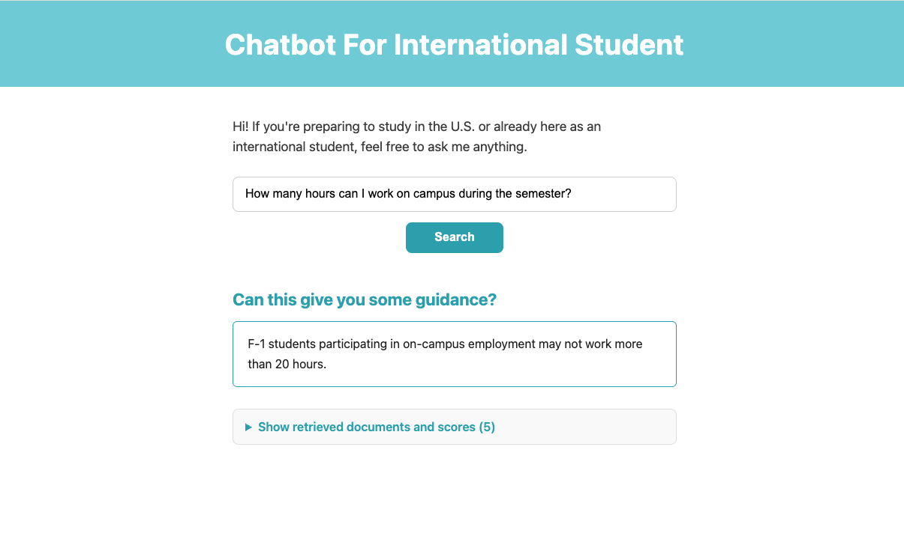
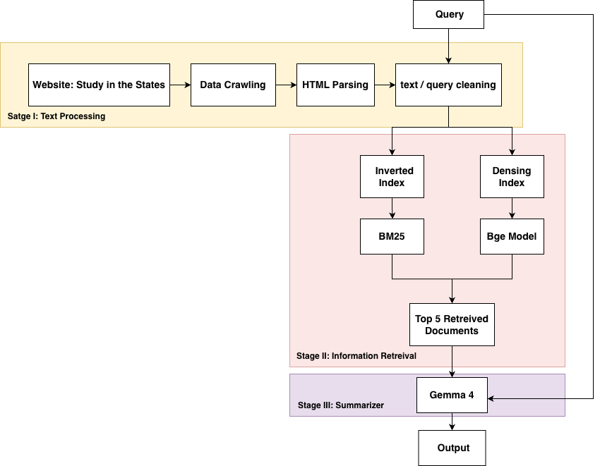

# International Student Assistant Chatbot



A beginner friendly web application (Flask app) that answers F-1 questions
by combining: 

- BM25 retreival
- Dense Retreival with BGE embeddings + FAISS
- Hybrid retreival using Reciprocal Rank Fustion (RRF)
- Local summarization with Ollama and gemma4:e2b

The app takes a user question, retreives the most relevant documents
from the corpus, and then uses the top results to generate a short
grounded summary. 


## Team

- Tianwei Shi
- Sheryll Liu
- Robert George
- Hima Bathula

## Architecture




# System Flow

1. The user enters a question through the Web App
2. HybridRetreiver searches the corpus using BM25, Dense Retreival
3. Two ranked lists are fused with RRF
4. Top 3 retreived results are passed to the summarizer 
5. The summarizer sends the query plus retreived evidence to Ollama
6. The Web App displays a short summary, as well as the retreived documents + scores

# Current Structure
- `rag_chatbot/web.py` — Flask web app and UI
- `rag_chatbot/information_retrieval/` — BM25, dense, and hybrid retrievers
- `rag_chatbot/summarizer/gamma4.py` — Ollama summarizer using `gemma4:e2b`
- `rag_chatbot/utils/` — crawling, parsing, cleaning, and index builders
- `rag_chatbot/eval/` — IR and summarizer evaluation scripts
- `src/international_student_assistant/cli.py` — `isa` command-line entry point
- `tests/` — pytest unit tests
- `data/` — raw HTML, processed CSVs, and built indices

# Setup

## 0. Install Git LFS (required to fetch data files)

```bash
# install git-lfs (skip if you already have it)
brew install git-lfs

# If you do not use Homebrew
winget install GitHub.GitLFS

# one-time per machine: register the LFS hooks with git
git lfs install

# if you already cloned before installing LFS, pull the real bytes now
git lfs pull
```

The LFS rules live in `.gitattributes` at the repo root.

## 1. Configure the Python environment with uv

We use [uv](https://docs.astral.sh/uv/) to manage the virtual environment and dependencies.
A single command installs everything declared in `pyproject.toml`, including the dev tools (pytest, ruff).

```bash
# install uv via Homebrew (skip if you already have it)
brew install uv

# If you do not use Homebrew 
curl -LsSf https://astral.sh/uv/install.sh | sh 

# from the repo root, create the venv and install all dependencies
uv sync --extra dev
```

## 2. Install Ollama and pull the summarizer model

The summarizer calls a locally running Ollama server at `http://localhost:11434`. It must be installed and have the `gemma4:e2b` model pulled before running the web app or the summarizer evaluation.

```bash
# Install Ollama via Homebrew (skip if you already have it)
brew install ollama

# If you do not use Homebrew (or from https://ollama.com/download）
curl -fsSL https://ollama.com/install.sh | sh

# pull the model used by the summarizer
ollama pull gemma4:e2b

# (optional) sanity-check the model
ollama run gemma4:e2b "hello"
```

**Ollama runs as a background service after installation. If it's not running, the summarizer falls back to returning the top retrieved document instead.**

# Run the Web App

Start the Flask demo with the CLI:

```bash
uv run isa serve
```

Then open http://127.0.0.1:8080/ in a browser.

To change the port, bind to all interfaces, or enable Flask's debug auto-reload:

```bash
uv run isa serve --host 0.0.0.0 --port 9000 --debug
```

# Run the Evaluations

Two evaluation pipelines are wired into the same `isa evaluate` command:

- **IR evaluation** — compares BM25 vs Hybrid retrieval on a gold query set, reporting P@5, R@5, MRR, Hit@5, and F1.
- **Summarizer evaluation** — scores generated summaries against gold references using ROUGE-1/2/L and BERTScore.

* Run both (default)

```bash
uv run isa evaluate
```

Runs IR first, then summarizer. **Requires Ollama to be running**, since the summarizer evaluation calls the model on every query.

* Run only the IR evaluation

No Ollama needed — pure retrieval quality on the gold queries.

```bash
uv run isa evaluate --no-summarizer
```

* Run only the summarizer evaluation

Skips the BM25-vs-Hybrid IR comparison and only scores generated summaries.

```bash
uv run isa evaluate --no-ir
```

# Run the Tests

The test suite uses `pytest` (installed via `uv sync --extra dev`):

```bash
uv run pytest
```

For per-test names and full output:

```bash
uv run pytest -v
```


